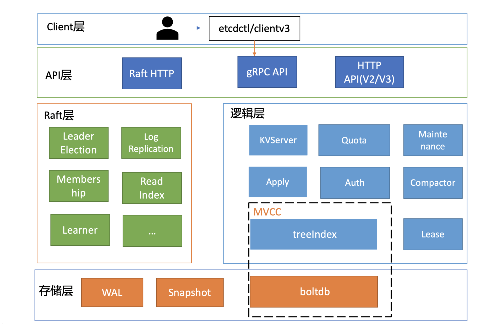
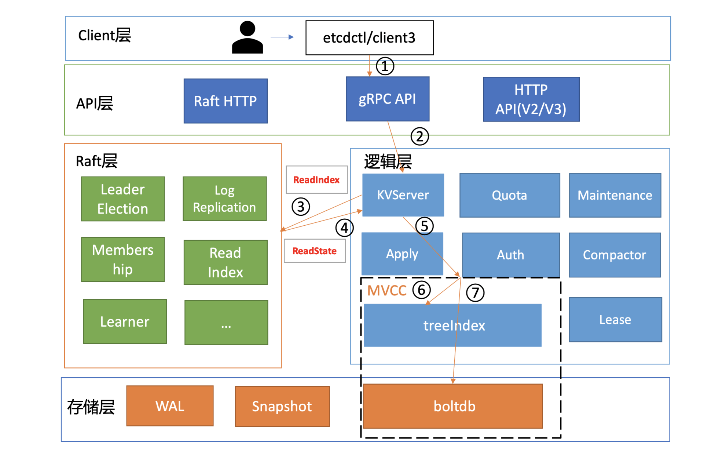

# etcd 读请求执行流程

## 1. 概述

下面是一张 etcd 的简要基础架构图



按照分层模型，etcd 可分为 Client 层、API 网络层、Raft 算法层、逻辑层和存储层。这些层的功能如下：

* **Client 层**：Client 层包括 client v2 和 v3 两个大版本 API 客户端库，提供了简洁易用的 API，同时支持负载均衡、节点间故障自动转移，可极大降低业务使用 etcd 复杂度，提升开发效率、服务可用性。
* **API 网络层**：API 网络层主要包括 client 访问 server 和 server 节点之间的通信协议。一方面，client 访问 etcd server 的 API 分为 v2 和 v3 两个大版本。v2 API 使用 HTTP/1.x 协议，v3 API 使用 gRPC 协议。同时 v3 通过 etcd grpc-gateway 组件也支持 HTTP/1.x 协议，便于各种语言的服务调用。另一方面，server 之间通信协议，是指节点间通过 Raft 算法实现数据复制和 Leader 选举等功能时使用的 HTTP 协议。
* **Raft 算法层**：Raft 算法层实现了 Leader 选举、日志复制、ReadIndex 等核心算法特性，用于保障 etcd 多个节点间的数据一致性、提升服务可用性等，是 etcd 的基石和亮点。
* **功能逻辑层**：etcd 核心特性实现层，如典型的 KVServer 模块、MVCC 模块、Auth 鉴权模块、Lease 租约模块、Compactor 压缩模块等，其中 MVCC 模块主要由 treeIndex 模块和 boltdb 模块组成。
* **存储层**：存储层包含预写日志 (WAL) 模块、快照 (Snapshot) 模块、boltdb 模块。其中 WAL 可保障 etcd crash 后数据不丢失，boltdb 则保存了集群元数据和用户写入的数据。


## 2. 读请求流程

具体流程如下图所示：



### etcd搭建

首先搭建一个 etcd 集群，单节点行。具体部署方法见[etcd系列(一)---通过docker安装etcd集群](https://lixueduan.com/post/etcd/01-install/)

安装好后就可以使用 etcd 客户端 etcdctl 进行交互了。

可以到[release界面](https://github.com/etcd-io/etcd/releases)下载一个也可以进入到容器中用容器里的 etcdctl，具体在`/usr/local/bin`目录下。

首先写入一条数据

```sh
# --endpoint=http://127.0.0.1:2379 用于指定后端的 etcd 地址
/usr/local/bin # etcdctl --endpoint=http://127.0.0.1:2379 set hello world
world
/usr/local/bin # etcdctl --endpoint=http://127.0.0.1:2379 get hello
world
```


### 2. 流程分析

### client

**1）首先，etcdctl 会对命令中的参数进行解析。**

“get”是请求的方法，它是 KVServer 模块的 API；“hello”是我们查询的 key 名；

“endpoints”是我们后端的 etcd 地址，通常，生产环境下中需要配置多个 endpoints，这样在 etcd 节点出现故障后，client 就可以自动重连到其它正常的节点，从而保证请求的正常执行。

**2）在解析完请求中的参数后，etcdctl 会创建一个 clientv3 库对象，使用 KVServer 模块的 API 来访问 etcd server。**

etcd clientv3 库采用的负载均衡算法为 Round-robin。针对每一个请求，Round-robin 算法通过轮询的方式依次从 endpoint 列表中选择一个 endpoint 访问 (长连接)，使 etcd server 负载尽量均衡。


### KVServer

client 发送 Range RPC 请求到了 server 后就进入了 KVServer 模块。

etcd 通过**拦截器**以非侵入式的方式实现了许多特性，例如：丰富的 metrics、日志、请求行为检查、所有请求的执行耗时及错误码、来源 IP 等。

拦截器提供了在执行一个请求前后的 hook 能力，除了我们上面提到的 debug 日志、metrics 统计、对 etcd Learner 节点请求接口和参数限制等能力，etcd 还基于它实现了以下特性:

* 1）要求执行一个操作前集群必须有 Leader；
* 2）请求延时超过指定阈值的，打印包含来源 IP 的慢查询日志 (3.5 版本)。

server 收到 client 的 Range RPC 请求后，根据 ServiceName 和 RPC Method 将请求转发到对应的 handler 实现，handler 首先会将上面描述的一系列拦截器串联成一个拦截器再执行（具体实现见[这里](https://github.com/grpc/grpc-go/blob/master/server.go#L1093)），在拦截器逻辑中，通过调用 KVServer 模块的 Range 接口获取数据。


## 参考


https://github.com/grpc/grpc-go/blob/master/server.go#L1093

https://en.wikipedia.org/wiki/Serializability 串行