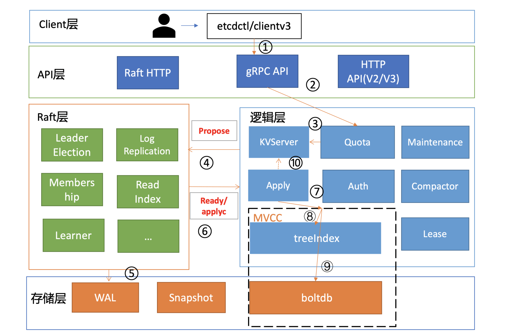
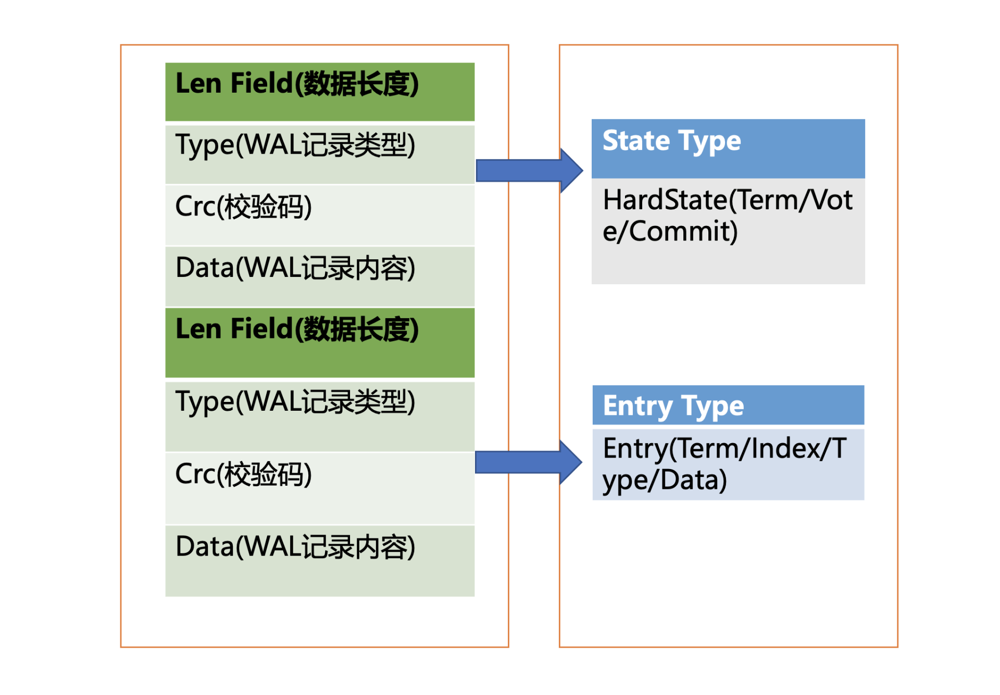

# etcd 写请求执行流程

## 1. 概述

以一个简单的写请求为例，

```sh
# 设置环境变量 指定使用 v3 版本API 否则可能会出现找不到 put 命令的情况
$ export ETCDCTL_API=3
$ etcdctl put hello world
ok
```

具体流程如下图所示：



* 1）首先 client 端通过负载均衡算法选择一个 etcd 节点，发起 gRPC 调用；
* 2）然后 etcd 节点收到请求后经过 gRPC 拦截器、Quota 模块后，进入 KVServer 模块；
* 3）KVServer 模块向 Raft 模块提交一个提案，提案内容为“大家好，请使用 put 方法执行一个 key 为 hello，value 为 world 的命令”。
* 4）随后此提案通过 RaftHTTP 网络模块转发、经过集群多数节点持久化后，状态会变成已提交；
* 5）etcdserver 从 Raft 模块获取已提交的日志条目，传递给 Apply 模块
* 6）Apply 模块通过 MVCC 模块执行提案内容，更新状态机。

与读流程不一样的是写流程还涉及 Quota、WAL、Apply 三个模块。etcd 的 crash-safe 及幂等性也正是基于 WAL 和 Apply 流程的 consistent index 等实现的。

## 2. Quota 模块

Quota 模块主要用于检查下当前 etcd db 大小加上你请求的 key-value 大小之和是否超过了配额（quota-backend-bytes）。

如果超过了配额，它会产生一个告警（Alarm）请求，告警类型是 NO SPACE，并通过 Raft 日志同步给其它节点，告知 db 无空间了，并将告警持久化存储到 db 中。

最终，无论是 API 层 gRPC 模块还是负责将 Raft 侧已提交的日志条目应用到状态机的 Apply 模块，都拒绝写入，集群只读。

常见的 “etcdserver: mvcc: database space exceeded" 错误就是因为Quota 模块检测到 db 大小超限导致的。

* 一方面默认 db 配额仅为 2G，当你的业务数据、写入 QPS、Kubernetes 集群规模增大后，你的 etcd db 大小就可能会超过 2G。
* 另一方面 etcd 是个 MVCC 数据库，保存了 key 的历史版本，当你未配置压缩策略的时候，随着数据不断写入，db 大小会不断增大，导致超限。

解决办法

* 1）首先当然是调大配额，etcd 社区建议不超过 8G。
  * 如果填的是个小于 0 的数，就会禁用配额功能，这可能会让db 大小处于失控，导致性能下降，不建议你禁用配额。
* 2）检查 etcd 的压缩（compact）配置是否开启、配置是否合理。
  * 压缩时只会给旧版本Key打上空闲（Free）标记，后续新的数据写入的时候可复用这块空间，db大小并不会减小。
  * 如果需要回收空间，减少 db 大小，得使用碎片整理（defrag）， 它会遍历旧的 db 文件数据，写入到一个新的 db 文件。但是它对服务性能有较大影响，不建议你在生产集群频繁使用。

调整后还需要手动发送一个取消告警（etcdctl alarm disarm）的命令，以消除所有告警，否则因为告警的存在，集群还是无法写入。


## 3. KVServer 模块

通过流程二的配额检查后，请求就从 API 层转发到了流程三的 KVServer 模块的 put 方法。

KVServer 模块主要功能为 

* 1）打包提案：将 put 写请求内容打包成一个提案消息，提交给 Raft 模块
* 2）请求限速、检查：不过在提交提案前，还有如下的一系列检查和限速，**限速、鉴权和大包检查**。


### Preflight Check

为了保证集群稳定性，避免雪崩，任何提交到 Raft 模块的请求，都会做一些简单的**限速判断**。

**限速**

如果 Raft 模块已提交的日志索引（committed index）比已应用到状态机的日志索引（applied index）超过了 5000，那么它就返回一个"etcdserver: too many requests"错误给 client。

**鉴权**

然后它会尝试去获取请求中的鉴权信息，若使用了密码鉴权、请求中携带了 token，如果 token 无效，则返回"auth: invalid auth token"错误给 client。

**大包检查**

其次它会检查你写入的包大小是否超过默认的 1.5MB， 如果超过了会返回"etcdserver: request is too large"错误给给 client。


### Propose

通过检查后会生成一个唯一的 ID，将此请求关联到一个对应的消息通知 channel（用于接收结果），然后向 Raft 模块发起（Propose）一个提案（Proposal）

向 Raft 模块发起提案后，KVServer 模块会等待此 put 请求，等待写入结果通过消息通知 channel 返回或者超时。etcd 默认超时时间是 7 秒（5 秒磁盘 IO 延时 +2*1 秒竞选超时时间），如果一个请求超时未返回结果，则可能会出现你熟悉的 etcdserver: request timed out 错误。


## 4. WAL 模块

Raft 模块收到提案后，如果当前节点是 Follower，它会转发给 Leader，**只有 Leader 才能处理写请求**。

Leader 收到提案后，通过 Raft 模块输出待转发给 Follower 节点的消息和待持久化的日志条目，日志条目则封装了我们上面所说的 put hello 提案内容。

etcdserver 从 Raft 模块获取到以上消息和日志条目后，作为 Leader，它会将 put 提案消息广播给集群各个节点，同时需要把集群 Leader 任期号、投票信息、已提交索引、提案内容持久化到一个 WAL（Write Ahead Log）日志文件中，用于保证集群的一致性、可恢复性，也就是我们图中的流程五模块。

### WAL 日志结构


WAL 日志结构如下：



WAL 文件它由多种类型的 WAL 记录顺序追加写入组成，每个记录由类型、数据、循环冗余校验码组成。不同类型的记录通过 Type 字段区分，Data 为对应记录内容，CRC 为循环校验码信息。

WAL 记录类型目前支持 5 种，分别是文件元数据记录、日志条目记录、状态信息记录、CRC 记录、快照记录：

* 1）文件元数据记录，包含节点 ID、集群 ID 信息，它在 WAL 文件创建的时候写入；
* 2）日志条目记录：包含 Raft 日志信息，如 put 提案内容；
* 3）状态信息记录，包含集群的任期号、节点投票信息等，一个日志文件中会有多条，以最后的记录为准；
* 4）CRC 记录，包含上一个 WAL 文件的最后的 CRC（循环冗余校验码）信息， 在创建、切割 WAL 文件时，作为第一条记录写入到新的 WAL 文件， 用于校验数据文件的完整性、准确性等；
* 5）快照记录，包含快照的任期号、日志索引信息，用于检查快照文件的准确性。

### WAL 持久化

首先会将 put 请求封装成一个 Raft 日志条目，Raft 日志条目的数据结构信息如下：

```go
type Entry struct {
   Term             uint64    `protobuf:"varint，2，opt，name=Term" json:"Term"`
   Index            uint64    `protobuf:"varint，3，opt，name=Index" json:"Index"`
   Type             EntryType `protobuf:"varint，1，opt，name=Type，enum=Raftpb.EntryType" json:"Type"`
   Data             []byte    `protobuf:"bytes，4，opt，name=Data" json:"Data，omitempty"`
}
```

它由以下字段组成：

* Term 是 Leader 任期号，随着 Leader 选举增加；
* Index 是日志条目的索引，单调递增增加；
* Type 是日志类型，比如是普通的命令日志（EntryNormal）还是集群配置变更日志（EntryConfChange）；
* Data 保存我们上面描述的 put 提案内容。

具体持久化过程如下：

* 1）它首先先将 Raft 日志条目内容（含任期号、索引、提案内容）序列化后保存到 WAL 记录的 Data 字段， 然后计算 Data 的 CRC 值，设置 Type 为 Entry Type， 以上信息就组成了一个完整的 WAL 记录。
* 2）最后计算 WAL 记录的长度，顺序先写入 WAL 长度（Len Field），然后写入记录内容，调用 fsync 持久化到磁盘，完成将日志条目保存到持久化存储中。
* 3）当一半以上节点持久化此日志条目后， Raft 模块就会通过 channel 告知 etcdserver 模块，put 提案已经被集群多数节点确认，提案状态为已提交，你可以执行此提案内容了。
* 4）于是进入流程六，etcdserver 模块从 channel 取出提案内容，添加到先进先出（FIFO）调度队列，随后通过 Apply 模块按入队顺序，异步、依次执行提案内容。


## 5. Apply 模块

Apply 模块主要用于执行处于 已提交状态的提案，将其更新到状态机。

Apply 模块在执行提案内容前，首先会判断当前提案是否已经执行过了，如果执行了则直接返回，若未执行同时无 db 配额满告警，则进入到 MVCC 模块，开始与持久化存储模块打交道。


**如果执行过程中 crash，重启后如何找回异常提案，再次执行的呢？**

主要依赖 WAL 日志，因为提交给 Apply 模块执行的提案已获得多数节点确认、持久化，etcd 重启时，会从 WAL 中解析出 Raft 日志条目内容，追加到 Raft 日志的存储中，并重放已提交的日志提案给 Apply 模块执行。

**重启恢复时，如何确保幂等性，防止提案重复执行导致数据混乱呢?**

etcd 通过引入一个 consistent index 的字段，来存储系统当前已经执行过的日志条目索引，实现幂等性。

因为 Raft 日志条目中的索引（index）字段，而且是全局单调递增的，每个日志条目索引对应一个提案。 如果一个命令执行后，我们在 db 里面也记录下当前已经执行过的日志条目索引，就可以解决幂等性问题了。

> 当然还需要将执行命令和记录index这两个操作作为原子性事务提交，才能实现幂等。


## 6. MVCC 模块

MVCC 主要由两部分组成，一个是内存索引模块 treeIndex，保存 key 的历史版本号信息，另一个是 boltdb 模块，用来持久化存储 key-value 数据。

**MVCC 模块执行 put hello 为 world 命令时，它是如何构建内存索引和保存哪些数据到 db 呢？**

### treeIndex

MVCC 写事务在执行 put hello 为 world 的请求时，会基于 currentRevision 自增生成新的 revision 如{2,0}，然后从 treeIndex 模块中查询 key 的创建版本号、修改次数信息。这些信息将填充到 boltdb 的 value 中，同时将用户的 hello key 和 revision 等信息存储到 B-tree，也就是下面简易写事务图的流程一，整体架构图中的流程八。

### boltdb

MVCC 写事务自增全局版本号后生成的 revision{2,0}，它就是 boltdb 的 key，通过它就可以往 boltdb 写数据了，进入了整体架构图中的流程九。

**那么写入 boltdb 的 value 含有哪些信息呢？**

写入 boltdb 的 value， 并不是简单的"world"，如果只存一个用户 value，索引又是保存在易失的内存上，那重启 etcd 后，我们就丢失了用户的 key 名，无法构建 treeIndex 模块了。

因此为了构建索引和支持 Lease 等特性，etcd 会持久化以下信息:

* key 名称；
* key 创建时的版本号（create_revision）、最后一次修改时的版本号（mod_revision）、key 自身修改的次数（version）；
* value 值；
* 租约信息。

boltdb value 的值就是将含以上信息的结构体序列化成的二进制数据，然后通过 boltdb 提供的 put 接口，etcd 就快速完成了将你的数据写入 boltdb。

注意：在以上流程中，etcd 并未提交事务（commit），因此数据只更新在 boltdb 所管理的内存数据结构中。

事务提交的过程，包含 B+tree 的平衡、分裂，将 boltdb 的脏数据（dirty page）、元数据信息刷新到磁盘，因此事务提交的开销是昂贵的。如果我们每次更新都提交事务，etcd 写性能就会较差。

etcd 的解决方案是合并再合并：

首先 boltdb key 是版本号，put/delete 操作时，都会基于当前版本号递增生成新的版本号，因此属于顺序写入，可以调整 boltdb 的 bucket.FillPercent 参数，使每个 page 填充更多数据，减少 page 的分裂次数并降低 db 空间。

其次 etcd 通过合并多个写事务请求，通常情况下，是异步机制定时（默认每隔 100ms）将批量事务一次性提交（pending 事务过多才会触发同步提交）， 从而大大提高吞吐量

**但是这优化又引发了另外的一个问题， 因为事务未提交，读请求可能无法从 boltdb 获取到最新数据。**

为了解决这个问题，etcd 引入了一个 bucket buffer 来保存暂未提交的事务数据。在更新 boltdb 的时候，etcd 也会同步数据到 bucket buffer。因此 etcd 处理读请求的时候会优先从 bucket buffer 里面读取，其次再从 boltdb 读，通过 bucket buffer 实现读写性能提升，同时保证数据一致性。

> 这里和 MySQL 很类似，更新时也是优先写入 Buffer。


## 7. 小结

* 1） Quota 模块工作原理和我们熟悉的 database space exceeded 错误触发原因
* 2）WAL 模块的存储结构，它由一条条记录顺序写入组成，每个记录含有 Type、CRC、Data，每个提案被提交前都会被持久化到 WAL 文件中，以保证集群的一致性和可恢复性。
* 3）Apply 模块基于 consistent index 和事务实现了幂等性，保证了节点在异常情况下不会重复执行重放的提案。
* 4）MVCC 模块是如何维护索引版本号、重启后如何从 boltdb 模块中获取内存索引结构的。
* 5）etcd 通过异步、批量提交事务机制，以提升写 QPS 和吞吐量。