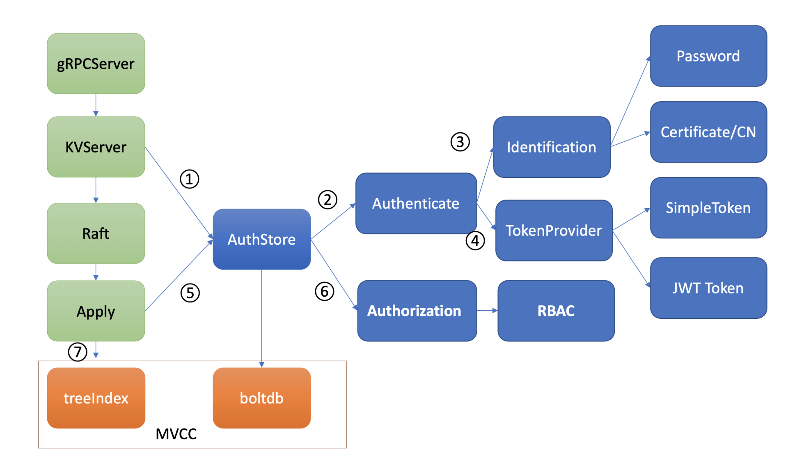
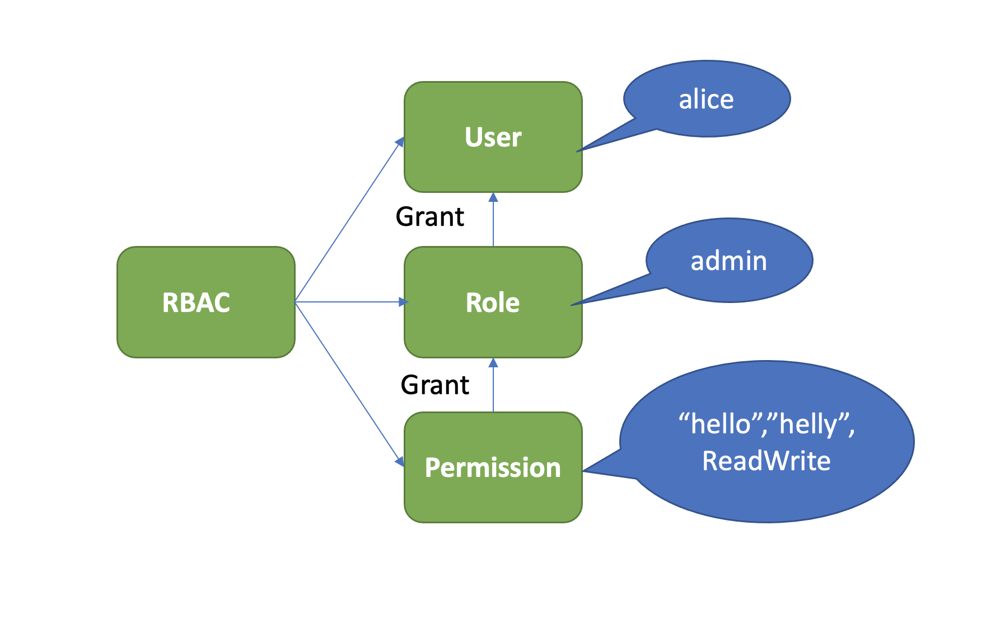

# etcd 鉴权

## 1. 概述

<<<<<<< HEAD
=======
etcd 鉴权体系架构由控制面和数据面组成。

### 1.1 控制面

etcd 鉴权体系控制面如下图所示：


你可以通过客户端工具 etcdctl 和鉴权 API 动态调整认证、鉴权规则，AuthServer 收到请求后，为了确保各节点间鉴权元数据一致性，会通过 Raft 模块进行数据同步。

当对应的 Raft 日志条目被集群半数以上节点确认后，Apply 模块通过鉴权存储 (AuthStore) 模块，执行日志条目的内容，将规则存储到 boltdb 的一系列“鉴权表”里面。

### 1.2 鉴权流程

etcd 数据面鉴权流程如下图所示：



鉴权流程由认证和授权流程组成。**在 KVServer 将请求发送给 Raft 模块之前需要进行鉴权。**

认证的目的是检查 client 的身份是否合法、防止匿名用户访问等。目前 etcd 实现了两种认证机制，分别是密码认证和证书认证。

认证通过后，为了提高密码认证性能，会分配一个 Token（类似我们生活中的门票、通信证）给 client，client 后续其他请求携带此 Token，server 就可快速完成 client 的身份校验工作。

实现分配 Token 的服务也有多种，这是 TokenProvider 所负责的，目前支持 SimpleToken 和 JWT 两种。

通过认证后，在访问 MVCC 模块之前，还需要通过授权流程。授权的目的是检查 client 是否有权限操作你请求的数据路径，etcd 实现了 RBAC 机制，支持为每个用户分配一个角色，为每个角色授予最小化的权限。


## 2. 认证机制

etcd 目前实现了两种机制，分别是**用户密码认证**和**证书认证**。

### 2.1 密码认证

etcd 支持为每个用户分配一个账号名称、密码。不过密码认证存在安全性和性能两个难题。

**安全性**：etcd 的用户密码存储融合了高安全性 hash 函数（Blowfish encryption algorithm）、随机的加盐 salt、可自定义的 hash 值计算迭代次数 cost 以保证安全性。

**性能**：当 etcd server 验证用户密码成功后，它就会返回一个 Token 字符串给 client，用于表示用户的身份。后续请求携带此 Token，就无需再次进行密码校验，极大的提升了性能。

etcd 目前支持两种 Token，分别为 Simple Token 和 JWT Token。

* Simple Token： 实现正如名字所言，简单。当一个用户身份验证通过后，生成一个随机的字符串值 Token 返回给 client，并在内存中使用 map 存储用户和 Token 映射关系
* JWT：Json Web Token 的缩写，一个基于 JSON 的开放标准（RFC 7519）定义的一种紧凑、独立的格式。

Simple Token 是有状态的，etcd server 需要使用内存存储 Token 和用户名的映射关系，同时可描述性很弱，client 无法通过 Token 获取到过期时间、用户名、签发者等信息。

JWT 则是无状态的，Token 自带用户名、版本号、过期时间等描述信息，etcd server 不需要保存它。


### 2.2 证书认证

密码认证一般使用在 client 和 server 基于 HTTP 协议通信的内网场景中。当对安全有更高要求的时候，你需要使用 HTTPS 协议加密通信数据，防止中间人攻击和数据被篡改等安全风险。

HTTPS 是利用非对称加密实现身份认证和密钥协商，因此使用 HTTPS 协议的时候，你需要使用 CA 证书给 client 生成证书才能访问。

**在 etcd 中，如果你使用了 HTTPS 协议并启用了 client 证书认证 (--client-cert-auth)，它会取证书中的 CN 字段作为用户名**。

证书认证在稳定性、性能上都优于密码认证。

* 稳定性上，它不存在 Token 过期、使用更加方便、会让你少踩坑，避免了不少 Token 失效而触发的 Bug
* 性能上，证书认证无需像密码认证一样调用昂贵的密码认证操作 (Authenticate 请求)，此接口支持的性能极低


## 3. RBAC

通过认证之后 etcd 还会对发出此请求的用户进行权限检查， 判断其是否有权限操作请求的数据，etcd 实现的是 RBAC(Role-based access control)制。

RBAC 由下图中的三部分组成，User、Role、Permission。

* User 表示用户，如 alice。
* Role 表示角色，它是权限的赋予对象。
* Permission 表示具体权限明细，比如赋予 Role 对 key 范围在[key，KeyEnd]数据拥有什么权限。目前支持三种权限，分别是 READ、WRITE、READWRITE。




## 4. Demo

### 4.1 创建用户

首先你可以通过如下的 auth enable 命令开启鉴权，注意 etcd 会先要求你创建一个 root 账号，它拥有集群的最高读写权限。

```sh
$ etcdctl user add root:root
User root created
# 开启鉴权
$ etcdctl auth enable
Authentication Enabled
```

然后创建一个测试用户

```sh
$ etcdctl user add alice:alice --user root:root
User alice created
```


### 4.2 赋予权限

按照上面介绍的 RBAC 原理，首先你需要创建一个 role，这里我们命名为 admin，然后新增了一个可读写[hello,helly]数据范围的权限给 admin 角色，并将 admin 的角色的权限授予了用户 alice。详细如下：

```sh

$ #创建一个admin role 
etcdctl role add admin  --user root:root
Role admin created
# #分配一个可读写[hello，helly]范围数据的权限给admin role
$ etcdctl role grant-permission admin readwrite hello helly --user root:root
Role admin updated
# 将用户alice和admin role关联起来，赋予admin权限给user
$ etcdctl user grant-role alice admin --user root:root
Role admin is granted to user alice
```


## 5. 小结 

* 0）在 KVServer 将请求发送给 Raft 模块之前进行鉴权。

* 1）密码安全性：高安全性 hash 函数（Blowfish encryption algorithm）、随机的加盐 salt、可自定义的 hash 值计算迭代次数 cost 以保证安全性；
* 2）性能：密码验证通过后下发 token，后续只验证 token 以提高性能；
* 3）通过 raft 保证各节点鉴权数据一致性；
* 4）RBAC 权限管理

>>>>>>> c9ed47e2b881283025a3c572b9a991d38af0b2f8
