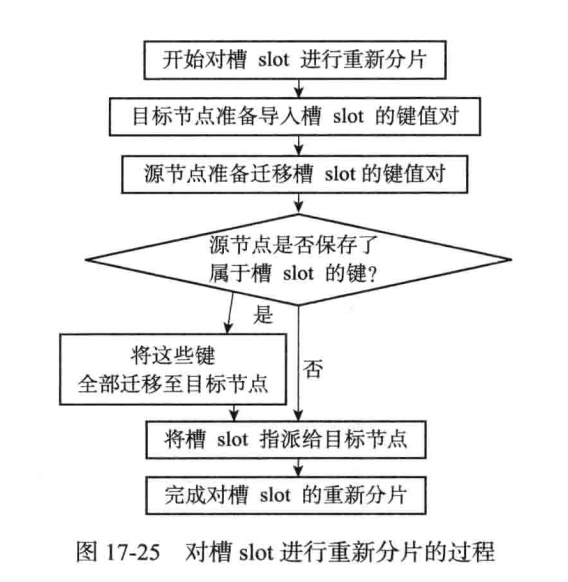

# RedisCluster

## 1. 概述

Redis集群是Redis提供的分布式数据库方案，集群通过分片(sharding)来进行数据共享，并提供复制和数据转移的功能。


## 2. 节点

### 1. 启动节点

Redis服务器在启动时会根据配置`cluster-enable`配置选项是否为yes来决定是否开启服务器的集群模式。


### 2. 加入集群

一个集群包含多个节点，可以通过`CLUSTER MEET`命令将多个节点加入到集群中。

```sh
CLUSTER MEET <ip> <port>
```

假设有3个Redis服务器

```sh
127.0.0.1:7000
127.0.0.1:7001
127.0.0.1:7002
```

然后杂`7000`节点执行这个命令

```sh
127.0.0.1:7000>CLUSTER MEET 127.0.0.1 7001
```

这样就把节点加入集群了。


**具体实现**

假设先连接上7000节点，然后执行以下命令

```c
127.0.0.1:7000>CLUSTER MEET 127.0.0.1 7001
```

* 1.节点7000会为节点7001创建一个clusterNode结构，存入自己的clusterState.nodes字典中
* 2.7000节点会根据`CLUSTER MEET`命令中给定的ip和port向7001节点发送一条MEET消息
* 3.如果顺利的话7001节点收到消息后会为节点7000创建一个clusterNode结构，存入自己的clusterState.nodes字典中
* 4.之后节点7001向节点7000返回一条PONG消息
* 5.节点7000收到PONG消息后知道7001已经收到了自己的MEET消息，这时会返回一个PING消息给7001节点
* 6.7001节点收到7000的PING消息，握手完成。


## 3. 槽指派

Redis集群通过分片来保存数据库中的键值对。集群中的整个数据库被分为16384(2^14)个槽(slot),数据库中的每个键都属于这16384个槽中的一个，每个节点中的数据可以处于0个(即为空 没有数据)或最多16384个槽。

当数据库中的16384个槽都有节点处理时集群处于上线状态(ok),如果有任何一个槽没有得到处理，那么集群处理下线状态(fail)。

### 1. 槽指派

前面将节点都加入集群了，但是没有分配槽，所以集群还处于下线状态，使用命令`CLUSTER ADDSLOTS`为节点分配槽。

```sh
127.0.0.1:7000>CLUSTER ADDSLOTS 0 1 2 3 ...5000
127.0.0.1:7001>CLUSTER ADDSLOTS 5001 5002...10000
127.0.0.1:7002>CLUSTER ADDSLOTS 10001 10002 ...16383
```

16384个槽都分配后集群将进入上线状态。


每个节点会将自己负责的槽存起来

```c
struct clusterNode {
    //...
    unsigned char slots[16483/8];
    int numslots;
    //...
}
```

`slots`是一个二进制数组，长度为16483/8=2048字节,共包含16384个二进制位。

值为1表示自己处理这个槽，0则表示不是自己处理的。

例如slots[0]=1 则表示第0号槽是自己处理的。

### 2. 传播指派信息

同时集群中每个节点都会将自己的slots数组发送给集群中的其他节点，这样集群中的每个节点都会知道数据库中16384个槽分别被指派给了哪些节点。

### 3. 所有指派信息

clusterState中保存了所有的指派信息。

```c
typedef struct clusterState {
    //...
    clusterNode *slots[16384];
    //...
}clusterState;
```

slots数组包含16384个项，每个数组项都指向一个clusterNode结构的指针：

* 如果slots[i]指向NULL表示槽尚未指派给任何节点
* 如果slots[i]指向clusterNode结构，那么表示槽已指派给clusterNode对应的节点

## 4. 集群中执行命令

在对数据库中16384个槽都指派了节点后，集群就会进入上线状态，可以接收客户端的请求了。

当客户端向集群中的节点发送与数据库键有关的命令时,接收命令的节点会计算出命令要处理的数据库键属于哪个槽，是否指派给自己了。

* 1.如果所在槽刚好指派给了当前节点，那么节点直接指向这个指令
* 2.如果没有则当前节点会向客户端返回一个MOVED错误，指引客户端转向(redirect)正确的节点,并在此发送之前想要执行的节点。

### 1. 如何计算槽

节点使用以下方法来计算给定key属于哪个槽。

```c
def slot_number(key):
	return CRC16(key) & 16383
```

` CRC16(key)`用于计算key的CRC-16校验和,然后和`16383`进行与运行,得到一个介于0到16383之间的整数作为key的槽号。

**为什么是16384个槽?**

`CRC16`算法产生的hash值有16bit，该算法可以产生2^16-=65536个值。换句话说，值是分布在0~65535之间。那作者在做`mod`运算的时候，为什么不`mod`65536，而选择`mod`16384？

因为集群中节点在发送`PING`、`PONG`消息时会带上自己负责的slot信息，所以如果槽越多那么消息就会越大。

**1.如果槽位为65536，发送心跳信息的消息头达8k，发送的心跳包过于庞大。**`myslots[CLUSTER_SLOTS/8]`。`65536÷8÷1024=8kb`

**2.redis的集群主节点数量基本不可能超过1000个**。

**3.槽位越小，节点少的情况下，压缩率高**


**是否由自己处理的？**

计算出槽号后根据clusterState.slots[i]是否等于clusterState.myself来判断是不是由自己处理的。

* 1.如果是则说明由自己处理的，直接指向命令
* 2.否则就会根据指向的clusterState中的ip和port向客户端返回MOVED错误,指引客户端转向正在处理槽i的节点。

### 2. MOVED错误

MOVED错误格式如下

```c
MOVED <slot> <ip>:<port>
```

例如

```c
MOVED 5000 127.0.0.1:7000
```

表示槽5000正有ip为127.0.0.1端口为7000的节点处理，客户端根据这个信息就能找到正确的节点了。

集群模式下MOVED错误会被客户端自动处理掉，并不会打印出来，所以我们是看不见节点返回MOVED错误的。


## 5. 数据库存储

集群模式下数据库存储和单机服务器是一样的。

唯一区别是节点只能使用数据库0，而单机服务器没这个限制。


## 6. 重新分片

Redis集群重新分片操作可以将任意数量已经指派给某个节点(源节点)的槽改为为指派给另一个节点(目标节点)，并且相关槽中的key也会从源节点移动到目标节点。

重新分片操作可以在线进行，在分片过程中集群不需要下线且源节点和目标节点可以继续处理命令请求。


### 实现原理

Redis集群重新分片操作由Redis集群管理软件`redis-trib`处理

流程如下：



1).redis-trib对目标节点发送`CLUSTER SETSLOT <slot> IMPORTING <source_id>`,让目标节点准备好从源节点导入(import)属于槽slot的键值对。

2).redis-trib对源节点发送`CLUSTER SETSLOT <slot> IMPORTING <target_id>`,让源节点准备好将属于槽slot的键值对迁移(migrate)至目标节点。

3).redis-trib向源节点发送`CLUSTER GETKEYSINSLOT <slot> <count>`获取最多count个数据slot槽的键值对。

4).对于3中获取到的每个键值对,redis-trib都向源节点发送一个`MIGRATE <target_ip> <target_port> <key_name> 0 <timeout>`命令将被选中的键原子地从源节点迁移至目标节点。

5).重复3 4步骤直到源节点所有键值对都迁移到目标节点

6).redis-trib向集群中任一节点发送`CLUSTER SETSLOT <slot> NODE <target_id>`命令，将槽slot已经指派给目标节点了这个消息发送至整个集群，最终集群中所有节点都直到槽slot以指派给目标节点了。

键值对迁移流程如下:


## 7. ASK错误

重写分片期间,数据迁移了一半，一部分在源节点一部分在目标节点。

这个时候客户端向源节点发送了一个与数据库键有关的命令。

* 1.源节点会先再自己的数据库里面查找指定键，如果有的话就执行命令
* 2.如果没有可能被迁移到目标节点了，返回一个ASK错误指引客户端转向正在迁移的目标节点，并在次发送命令。

ASK错误和MOVED错误一样，客户端会自动处理不会打印出来

## 8. 复制与故障转移

Redis集群中的节点分为主节点(master)和从节点(slave),其中主节点用于处理槽，从节点用于复制某个主节点或主节点下线后代替主节点接收执行请求。


### 1.设置从节点

向一个节点发送以下命令:

```c
CLUSTER REPLICATE <node_id>
```

接收该命令可以让节点成为node_id节点的从节点,并开始对主节点进行复制。

接收到该命令的节点沪修改自己的clusterNode结构中的slaveof指向主节点

```c
struct clusterNode {
    //...
    //如果是从节点 那么这个会指向主节点
    struct clusterNode *slaveof;
    //...    
}
```

同时会把这个消息发给集群中其他节点,最终集群中所有节点都知道当前节点作为从节点在复制node_id节点。

### 2. 故障检测

集群中每个节点都会定期地向集群中其他节点发送PING消息，以此来检测对方是否下线。如果接收到的节点没有在规定时间内返回PONG，那么发送PING的节点就会将这个节点标记为疑是下线。

如果集群中半数以上的主节点都将某个主节点(假设是A节点)标记为疑是下线，那么这个主节点会被标记为已下线，同时会向集群发送一条节点A的FALL消息，收到消息的节点都会讲节点A标记为已下线。

### 3. 故障转移

从节点发现自己的主节点进入已下线状态后,从节点会进行故障转移。

步骤如下：

* 1.从已下线的主节点的下属从节点中选一个执行`SLAVEOF no one`命令，解除从节点身份，提升为新的主节点
* 2.新的主节点会将指派给旧主节点的槽撤销并指派给自己
* 3.向集群广播一条PONG消息,让其他节点知道这个节点已经成了主节点且接管了由旧主节点负责处理的槽。
* 4.新的主节点开始接收并处理和自己处理的槽有关的命令，故障转移完成


选取方法和选取领头Sentinel的方法很像，都是基于Raft算法实现了

* 1.集群的配置纪元是一个自增计数器，它的初始值为0。
* 2.当集群里的某个节点开始一次故障转移操作时，集群配置纪元的值会被增一。
* 3.对于每个配置纪元.集群里每个负责处理槽的主节点都冇一次投票的机会，而第一个向主节点请求投票的从节点将获得主节点的投票。
* 4.当从节点发现正在复制的主节点进入已下线状态时，从节点会向集群广播一条  `CLUSTERMSG_TYPE_FAILOVER_AUTH_REOUEST`消息，要求所有收到这条消息并且具有投票权的主节点向这个从节点投栗。
* 5.如果一个主节点具有投票权，并且这个主节点尚未投票给 
  他其他从节点，那么主节点将向要求投票的从节点返回一条`CLUSTERMSG_TYPE_FAILOVER_ 
  AUTH_ACK`消息.表示这个主节点支持从节戍成为新的主节点。
* 6.每个参与选举的从节点都会接收CLISTERMSG_TYPE_FAILOVER_AUTH_ACK消息，并根据自己收到了多少条这种消息来统计自己获得了多少主节点的支持。
* 7.如果集群共有N个具有投票权的主节点，那么当一个从节点收集到大于等于N/2+1 张支持票时，这个从节点就会当选为新的主节点。
* 8.因为在每一个配置纪元里面.每个具有投票权的主节点只能投一次票，所以如果有 N个主节点进行投票，那么获得N/2+1张支持票的节点只有一个，从而保证了只会有一个新主节点。
* 9.如果在一个配置纪元里面没有从节点能收集到足够多的支持票.那么集群进入一个新配置纪元再次进行选举，直到选出来新的主节点。


## 9. 小结

- 节点通过握手来将其他节点添加到自己所处的集群当中。
- 集群中的 `16384` 个槽可以分别指派给集群中的各个节点， 每个节点都会记录哪些槽指派给了自己， 而哪些槽又被指派给了其他节点。
- 节点在接到一个命令请求时， 会先检查这个命令请求要处理的键所在的槽是否由自己负责， 如果不是的话， 节点将向客户端返回一个`MOVED` 错误， `MOVED` 错误携带的信息可以指引客户端转向至正在负责相关槽的节点。
- 对 Redis 集群的重新分片工作是由客户端执行的， 重新分片的关键是将属于某个槽的所有键值对从一个节点转移至另一个节点。
- 如果节点 A 正在迁移槽 `i` 至节点 B ， 那么当节点 A 没能在自己的数据库中找到命令指定的数据库键时， 节点 A 会向客户端返回一个 `ASK` 错误， 指引客户端到节点 B 继续查找指定的数据库键。
- `MOVED` 错误表示槽的负责权已经从一个节点转移到了另一个节点， 而 `ASK` 错误只是两个节点在迁移槽的过程中使用的一种临时措施。
- 集群里的从节点用于复制主节点， 并在主节点下线时， 代替主节点继续处理命令请求。
- 集群中的节点通过发送和接收消息来进行通讯， 常见的消息包括 `MEET` 、 `PING` 、 `PONG` 、 `PUBLISH` 、 `FAIL` 五种。