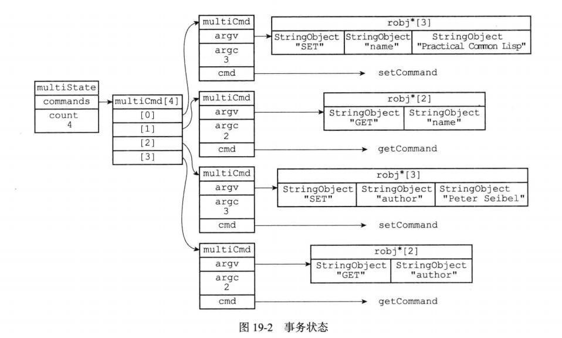

# Redis事务

## 1. 概述

Redis通过`MULTI `、`EXEC`、`WATCH`等命令来实现事务(transation)。

事务提供了一种将多个请求打包，然后一次性、按顺序执行的机制,并且在事务执行过程中，服务器不会中断事务去执行其他客户端的命令，知道事务中所有命令都执行完毕才会去处理其他客户端的请求。

一个事务从开始到执行会经历以下三个阶段：

- 开始事务。
- 命令入队。
- 执行事务。


## 2. 实现

### 1. MULTI

打开事务,通过修改客户端状态中flags属性中打开`REDIS_MULTI`标识来实现的。

###  2. 命令入队

客户端不在事务模式是所有命令将会被立即执行。

切换到事务模式后执行`EXEC`、`DISCARD`、`WATCH`、`MULTI`四个命令才会立即执行,其他命令都会放入事务队列并向客户端返回`QUEUND`回复。


### 3. 事务队列

每个Redis客户端都有自己的事务队列。

```c
typedef struct redisClient {
    //...
    // 事务状态
    multiState mstate;
    //...
}redisClient;
```

事务状态包含一个事务队列,以及一个已入队的计数器(可以看做是事务队列的长度):

```c
typedef struct multiState {
    // 事务队列 FIFO
    multiCmd *commands;
    // 已入队命令计数
    int count;
}multiState;
```

事务队列`commands`是一个`multiCmd`类型的数组，每个`multiCmd`都保存了已入队列命令的相关信息,包括指向命令实现函数的指针、命令的参数、以及参数数量等：

```c
typedef struct multiCmd {
    // 参数
    robj **argv;
    // 参数数量
    int argc;
    // 命令指针
    struct redisCommand *cmd;
}multiCmd;
```




### 4. 执行事务

处于事务状态的客户端发送`EXEC`命令时，这个EXEC命令将会立即被执行。

> 当然服务器会先检查`REDIS_DIRTY_CAS`标识，具体看下面`WATCH`机制

服务器会遍历这个客户端的事务队列并执行里面保存的所有命令，最后将执行结果全部返回给客户端。


### 5. WATCH

每个Redis数据库都保存着一个`watchd_keys`字典，键是被watch的数据库键，value则是一个链表，链表中记录了所有watch这个键的客户端。

```c
typedef struct redisDb {
    //...
    //正在被WATH命令监视的key
    dict *watchd_keys;
    //...
}redisDb;
```

通过`watchd_keys`字典服务器可以清楚的知道哪些键在被哪些客户端监视。


**WATCH触发**

所有对数据库修改的命令(`SET`、`LPUSH`、`SADD`、`DEL`等等)，在执行后都会调用`mylti.c/touchWatchKey`函数对`watchd_keys`字典进行检查，查看是否有客户端正在监视刚才被修改的键。如果有那么`touchWatchKey`函数会把被修改的客户端的`REDIS_DIRTY_CAS`标识打开,标识该客户端的事务安全性已经被破坏。

客户端执行`EXEC`命令前,服务器会检查这个标识是否被打开，被打开则拒绝执行客户端提交的事务，否则正常执行。

## 3. 事务ACID特性

关系型数据库事务都满足四大特性，原子性(Atomicity)、一致性(Consistency)、隔离性(Isolation)、持久性(Durability)。

### 1.原子性(Atomicity)

原子性指将事务中的多个操作当做一个整体。要么都执行，要么都不执行。

对于Redis来说事务队列中的命令也是要么都执行要么都不执行。

当然了Redis事务和传统事务最大的不同是执行失败后没有回滚机制，作者解释说不支持事务回滚是因为这种复杂的功能和Redis追求的简单高效的设置主旨不符。

### 2. 一致性(Consistency)

事务具有一致性指的是数据库再执行事务前是一致的，那么在执行事务之后(不管成功与否)数据库也应该是一致的。

Redis通过谨慎的错误检查和简单的设计来保证事务的一致性。

**1. 入队错误**

事务在入队命令出现命令不存在,格式错误等情况,那么Redis将拒绝这个事务

**2. 执行错误**

事务执行过程中,出错的命令会被服务器识别出来，并进行相应的错误处理了，所以这些错误命令不会对数据库做任何修改，也不会对事务的一致性产生任何影响。

**3. 服务器停机**

如果事务执行过程中出现服务器停机，根据服务器使用的持久化模式会出现几种情况：

* 1.使用RDB或AOF持久化 那么重启后可以恢复到一个一致的状态

* 2.没使用持久化或招不到可用的持久化文件，那么重启后数据库为空 是一致的

### 3. 隔离性(Isolation)

事务的隔离性指的是，即使数据库有多个事务同时执行，各个事务直接也不会互相干扰，并且在并发状态下执行和和串行执行结果完全一致。

Redis是单线程方式来执行事务并且在执行过程中不会中断事务，所以Redis事务总是以串行的方式执行的，并且有总是具有隔离性的。


### 4. 持久性(Durability)

事务持久性指的时是事务执行完成后结果会被保存到永久性存储介质中,即使服务器停机了事务的执行结果也不会丢失。

Redis事务只是简单的用队列包裹起了一组Redis命令，并没有提供单独的持久化功能，所以Redis事务持久性由Redis所使用的持久化模式决定：

只有使用AOF持久化且`appendfsync`选项的值为`always`时(即每条命令都保存)事务才有持久。
其他请求如:没使用持久化，或RDB持久化或者AOF持久化配置的1秒写一次或者其他都可能会丢失数据,所以没有持久性。


## 4. 小结

- 事务提供了一种将多个命令打包， 然后一次性、有序地执行的机制。
- 多个命令会被入队到事务队列中， 然后按先进先出（FIFO）的顺序执行。
- 事务在执行过程中不会被中断， 当事务队列中的所有命令都被执行完毕之后， 事务才会结束。
- 带有 WATCH 命令的事务会将客户端和被监视的键在数据库的 `watched_keys` 字典中进行关联， 当键被修改时， 程序会将所有监视被修改键的客户端的 `REDIS_DIRTY_CAS` 标志打开。
- 只有在客户端的 `REDIS_DIRTY_CAS` 标志未被打开时， 服务器才会执行客户端提交的事务， 否则的话， 服务器将拒绝执行客户端提交的事务。
- Redis 的事务总是保证 ACID 中的原子性、一致性和隔离性， 当服务器运行在 AOF 持久化模式下， 并且 `appendfsync` 选项的值为`always` 时， 事务也具有耐久性