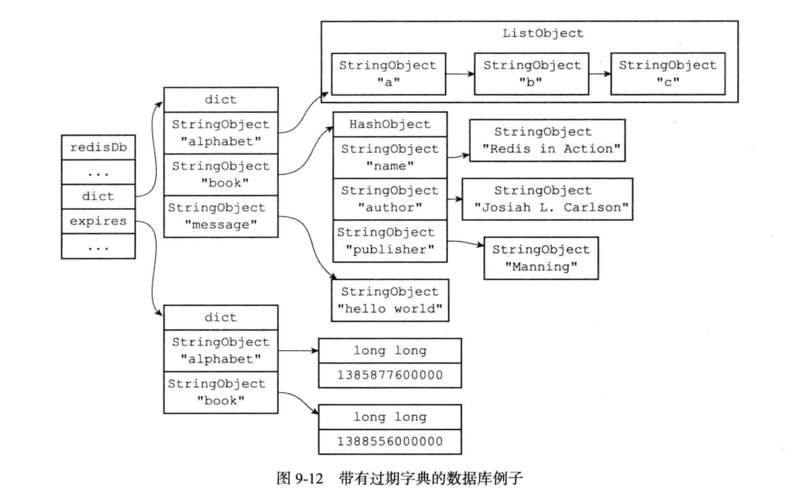

# Redis单机数据库实现

## 1. 概述

Redis服务器中的所有数据库都保存在服务器状态`redis.h/redisServer`结构的db数组中，服务器初始化时会根据`dbnum`创建多个数据库，默认是`16`个

```c
struct redisServer {
    // ...
    //一个数组 保存着服务器中的所有数据库
    redisDb *db
    // ...
    // 服务器数量
    int dbnum
}
```

db数组中每一项都是一个`redis.h/redisDb`结构,每一个redisDb代表一个数据库

```c
typedef struct redisDb {

    // ...

    // 数据库键空间，保存着数据库中的所有键值对
    dict *dict;

    // ...

} redisDb;
```

## 2. 键空间(key space)

Redis数据库中包含两个`字典`。其中`dict`字典保存了数据库中的所有键值对， 我们将这个字典称为键空间（key space)。


键空间和用户所见的数据库是直接对应的：

- 键空间的键也就是数据库的键， 每个键都是一个字符串对象。
- 键空间的值也就是数据库的值， 每个值可以是字符串对象、列表对象、哈希表对象、集合对象和有序集合对象在内的任意一种 Redis 对象。

举个例子， 如果我们在空白的数据库中执行以下命令：

```
redis> SET message "hello world"
OK

redis> RPUSH alphabet "a" "b" "c"
(integer) 3

redis> HSET book name "Redis in Action"
(integer) 1

redis> HSET book author "Josiah L. Carlson"
(integer) 1

redis> HSET book publisher "Manning"
(integer) 1
```

那么在这些命令执行之后， 数据库的键空间将会是图 IMAGE_DB_EXAMPLE 所展示的样子：

- `alphabet` 是一个列表键， 键的名字是一个包含字符串 `"alphabet"` 的字符串对象， 键的值则是一个包含三个元素的列表对象。
- `book` 是一个哈希表键， 键的名字是一个包含字符串 `"book"` 的字符串对象， 键的值则是一个包含三个键值对的哈希表对象。
- `message` 是一个字符串键， 键的名字是一个包含字符串 `"message"` 的字符串对象， 键的值则是一个包含字符串 `"hello world"` 的字符串对象。


**各种操作**

添加键:将一个键值对添加到键空间字典里

删除键:从键空间字典中删除键值对

更新:更新键空间字典中的键值对

对键取值:先在键空间中找到key，然后查询对应的value。

## 3. 过期字典

redisDb结构中的`expires`字典保存了所有的过期时间,我们称之为过期字典。

```c
typedef struct redisDb {

    // ...

    // 过期字典 保存着键的过期时间
    dict *expires;

    // ...

} redisDb;
```

结构如下




操作和键空间类似。

**给定键是否过期的判定？**

* 1.检查是否在过期字典中,在则取到过期时间
* 2.检查当前Unix时间戳是否大于过期时间,是则过期否则未过期。

## 4. 过期键删除策略

### 1. 具体策略

**1. 定时删除**

在设置过期时间的时候就添加一个定时器，过期时间一到就把这个键给删除掉。

对内存友好但可能会占用大量cpu,在cpu紧张的时候会对吞吐量造成较大影响。

**2. 惰性删除**

不做任何操作，每次获取键时如果已经过期则删除，否则返回该键。

对cpu友好但是对内存不友好，如果一个键过期之后不执行查询操作或手动删除就会一直保留在数据库中,内存得不到释放。

**3.定期删除**

每隔一段时间程序就对服务器进行一次检查，删除里面的过期键。

至于删除多少过期键，检查多少数据库则由算法决定。

是前两种策略的折中，难点是设置执行时长和执行频率。

> 执行太频繁就会退化成定时删除，执行间隔太久又会退化为惰性删除，浪费内存。

###  2. Redis策略实现

Redis服务器当前使用的是**`惰性删除`**和**`定期删除`**两种策略，通过两种策略配合可以很好的在占用CPU时间和浪费内存空间之间取得平衡。

#### 1. 惰性删除

所有读写数据库的Redis命令执行前都会调用`expireIfNeed`函数对键进行检查，如果过期则删除键，否则不执行任何操作

类似过滤器，在真正执行命令前过滤掉已经过期的输入键，避免命令接触到过期键。

#### 2. 定期检查

Redis服务器周期性调用serverCron时会调用`activeExpireCycle`函数，

它在规定时间内，分多次遍历服务器中的各个数据库，从数据库的expires字典中随机检查一部分键的过期时间，并删除其中的过期键。

> 默认检查数据库为16个。
>
> 默认检查键为20个。
>
> 检查时会记录下当前正在检查的db(current_db)，如果时间到了将立即返回，下次检查则从这个db开始。如果当current_db=总db数或默认检查db数时将重置，然后开始新一轮检查。

### 3. 持久化和复制时的相关处理

**RDB**

如果是RDB方式持久化，在生成快照文件时不会保存已过期的键。

**AOF**

如果是AOF方式则不会做任何处理,只有在定期检查或惰性删除到过期键时 会在AOF文件中追加一个显示的删除命令。

**AOF文件重写**

AOF文件重写时会对键进行检查,已过期的键不会写入重写后的AOF文件。

**复制**

* 主服务器发现过期键时会显式给从服务器发送Del命令删除该key

* 从服务器直接读操作时发现key过期也不会删除，会当做未过期key处理,只有等主服务器发来Del命令才会删除

## 5. 小结

- Redis 服务器的所有数据库都保存在 `redisServer.db` 数组中， 而数据库的数量则由 `redisServer.dbnum` 属性保存。
- 客户端通过修改目标数据库指针， 让它指向 `redisServer.db` 数组中的不同元素来切换不同的数据库。
- 数据库主要由 `dict` 和 `expires` 两个字典构成， 其中 `dict` 字典负责保存键值对， 而 `expires` 字典则负责保存键的过期时间。
- 因为数据库由字典构成， 所以对数据库的操作都是建立在字典操作之上的。
- 数据库的键总是一个字符串对象， 而值则可以是任意一种 Redis 对象类型， 包括字符串对象、哈希表对象、集合对象、列表对象和有序集合对象， 分别对应字符串键、哈希表键、集合键、列表键和有序集合键。
- `expires` 字典的键指向数据库中的某个键， 而值则记录了数据库键的过期时间， 过期时间是一个以毫秒为单位的 UNIX 时间戳。
- Redis 使用惰性删除和定期删除两种策略来删除过期的键： 惰性删除策略只在碰到过期键时才进行删除操作， 定期删除策略则每隔一段时间， 主动查找并删除过期键。
- 执行 SAVE 命令或者 BGSAVE 命令所产生的新 RDB 文件不会包含已经过期的键。
- 执行 BGREWRITEAOF 命令所产生的重写 AOF 文件不会包含已经过期的键。
- 当一个过期键被删除之后， 服务器会追加一条 DEL 命令到现有 AOF 文件的末尾， 显式地删除过期键。
- 当主服务器删除一个过期键之后， 它会向所有从服务器发送一条 DEL 命令， 显式地删除过期键。
- 从服务器即使发现过期键， 也不会自作主张地删除它， 而是等待主节点发来 DEL 命令， 这种统一、中心化的过期键删除策略可以保证主从服务器数据的一致性。
- 当 Redis 命令对数据库进行修改之后， 服务器会根据配置， 向客户端发送数据库通知。

