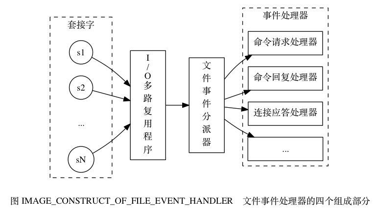

# Redis文件事件

## 1. 概述

Redis 基于 [Reactor 模式](http://en.wikipedia.org/wiki/Reactor_pattern)开发了自己的网络事件处理器： 这个处理器被称为**文件事件处理器(file event handler)**：

- 文件事件处理器使用 [I/O 多路复用（multiplexing）](http://en.wikipedia.org/wiki/Multiplexing)程序来同时监听多个套接字， 并根据套接字目前执行的任务来为套接字关联不同的事件处理器。
- 当被监听的套接字准备好执行连接应答（accept）、读取（read）、写入（write）、关闭（close）等操作时， 与操作相对应的文件事件就会产生， 这时文件事件处理器就会调用套接字之前关联好的事件处理器来处理这些事件。

虽然文件事件处理器以单线程方式运行， 但通过使用 I/O 多路复用程序来监听多个套接字， 文件事件处理器既实现了高性能的网络通信模型， 又可以很好地与 Redis 服务器中其他同样以单线程方式运行的模块进行对接， 这保持了 Redis 内部单线程设计的简单性。


## 2. 构成

文件事件处理器的四个组成部分， 它们分别是`套接字`、 `I/O 多路复用程序`、 `文件事件分派器(dispatcher)`、 以及`事件处理器`。



文件事件是对套接字操作的抽象， 每当一个套接字准备好执行连接应答（accept）、写入、读取、关闭等操作时， 就会产生一个文件事件。 因为一个服务器通常会连接多个套接字， 所以多个文件事件有可能会并发地出现。

I/O 多路复用程序负责监听多个套接字， 并向文件事件分派器传送那些产生了事件的套接字。

尽管多个文件事件可能会并发地出现， 但 I/O 多路复用程序总是会将所有产生事件的套接字都入队到一个队列里面， 然后通过这个队列， 以有序（sequentially）、同步（synchronously）、每次一个套接字的方式向文件事件分派器传送套接字： 当上一个套接字产生的事件被处理完毕之后（该套接字为事件所关联的事件处理器执行完毕）， I/O 多路复用程序才会继续向文件事件分派器传送下一个套接字


## 3. I/O 多路复用程序的实现

Redis 的 I/O 多路复用程序的所有功能都是通过包装常见的 `select` 、 `epoll` 、 `evport` 和 `kqueue` 这些 I/O 多路复用函数库来实现的。

因为 Redis 为每个 I/O 多路复用函数库都实现了相同的 API ， 所以 I/O 多路复用程序的底层实现是可以互换的。

实现源码中用 `#include` 宏定义了相应的规则， 程序会在编译时自动选择系统中性能最高的 I/O 多路复用函数库来作为 Redis 的 I/O 多路复用程序的底层实现。

```c
/* Include the best multiplexing layer supported by this system.
 * The following should be ordered by performances, descending. */
#ifdef HAVE_EVPORT
#include "ae_evport.c"
#else
    #ifdef HAVE_EPOLL
    #include "ae_epoll.c"
    #else
        #ifdef HAVE_KQUEUE
        #include "ae_kqueue.c"
        #else
        #include "ae_select.c"
        #endif
    #endif
#endif
```

## 4. 事件的类型

I/O 多路复用程序可以监听多个套接字的 `ae.h/AE_READABLE` 事件和 `ae.h/AE_WRITABLE` 事件， 这两类事件和套接字操作之间的对应关系如下：

- 当套接字变得可读时（客户端对套接字执行 `write` 操作，或者执行 `close` 操作）， 或者有新的可应答（acceptable）套接字出现时（客户端对服务器的监听套接字执行 `connect` 操作）， 套接字产生 `AE_READABLE` 事件。
- 当套接字变得可写时（客户端对套接字执行 `read` 操作）， 套接字产生 `AE_WRITABLE` 事件。

I/O 多路复用程序允许服务器同时监听套接字的 `AE_READABLE` 事件和 `AE_WRITABLE` 事件， 如果一个套接字同时产生了这两种事件， 那么文件事件分派器会优先处理 `AE_READABLE` 事件， 等到 `AE_READABLE` 事件处理完之后， 才处理 `AE_WRITABLE` 事件。

这也就是说， 如果一个套接字又可读又可写的话， 那么服务器将先读套接字， 后写套接字。

## 5. 文件事件的处理器

Redis 为文件事件编写了多个处理器， 这些事件处理器分别用于实现不同的网络通讯需求， 比如说：

- 为了对连接服务器的各个客户端进行应答， 服务器要为监听套接字关联连接应答处理器。
- 为了接收客户端传来的命令请求， 服务器要为客户端套接字关联命令请求处理器。
- 为了向客户端返回命令的执行结果， 服务器要为客户端套接字关联命令回复处理器。
- 当主服务器和从服务器进行复制操作时， 主从服务器都需要关联特别为复制功能编写的复制处理器。
- 等等。

在这些事件处理器里面， 服务器最常用的要数与客户端进行通信的连接应答处理器、 命令请求处理器和命令回复处理器。

## 6. 时间事件

Redis时间事件可以分为两类：

* 1.定时时间：让一段程序在指定的时间之后执行一次。
* 2.周期性时间：让一段程序每隔一定时间就执行一次。

### 实现

Redis将所有时间事件都放在一个链表中,每当时间事件执行器运行时就遍历整个链表，查找已经到达的时间事件并调用对应的事件处理器。


当前版本Redis只有`serverCron`一个时间事件，主要包括如下功能：

* 1.更新统计信息，比如时间、内存占用等
* 2.清理过期键值对
* 3.关闭和清理连接失效的client
* 4.尝试RDB或AOF持久化
* 5.若为主服务器则定期进行主从同步
* 6.若为集群模式，则定期对集群同步和测试


默认100毫秒执行一次，用户可以通过`redis.conf`中的`hz`参数进行调整。


Redis文件事件和时间事件的处理都是同步、有序、原子地执行的，不会中断事件也不会出现强占情况。

> 一边处理或者等待文件事件达到，同时检测时间事件，时间到了则会执行时间事件,如果正在处理文件事件那么时间事件将会等待文件事件处理完之后才能被执行，所以有可能会比设定的时间慢一些。

## 7. 小结

- Redis 服务器是一个事件驱动程序， 服务器处理的事件分为时间事件和文件事件两类。
- 文件事件处理器是基于 Reactor 模式实现的网络通讯程序。
- 文件事件是对套接字操作的抽象： 每次套接字变得可应答（acceptable）、可写（writable）或者可读（readable）时， 相应的文件事件就会产生。
- 文件事件分为 `AE_READABLE` 事件（读事件）和 `AE_WRITABLE` 事件（写事件）两类。
- 时间事件分为定时事件和周期性事件： 定时事件只在指定的时间达到一次， 而周期性事件则每隔一段时间到达一次。
- 服务器在一般情况下只执行 `serverCron` 函数一个时间事件， 并且这个事件是周期性事件。
- 文件事件和时间事件之间是合作关系， 服务器会轮流处理这两种事件， 并且处理事件的过程中也不会进行抢占。
- 时间事件的实际处理时间通常会比设定的到达时间晚一些。