# OBS使用教程


## 1. 下载

官网地址:

```sh
https://obsproject.com/
```

当前最新版本为`Windows 24.03 macOS 24.06 Linux 24.03`

如何官网下载慢的话，本文提供了百度云网盘链接。

```sh
链接：https://pan.baidu.com/s/1nwfcW--UihMAWnqSKqdA3Q 
提取码：iggi
```


## 2. 安装

选好安装位置无脑下一步即可，其中那个插件可以`不勾选`，保持默认即可。

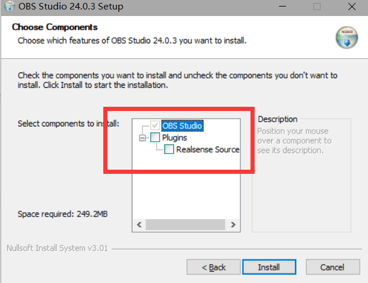

安装好后点击`Finish`打开`OBS`


## 3. 配置

初次打开软件界面大概是这个样子的

**最好设置成使用管理员身份运行OBS，否则可能会出现无法捕获到画面的问题**


旧版本是需要用户手动调节所有参数的,新版增加了这个`自动配置向导`功能，可以点击`是`直接根据自动配置向导进行配置。


如果这里点错了，也可以根据`工具->自动配置向导`重新进行配置

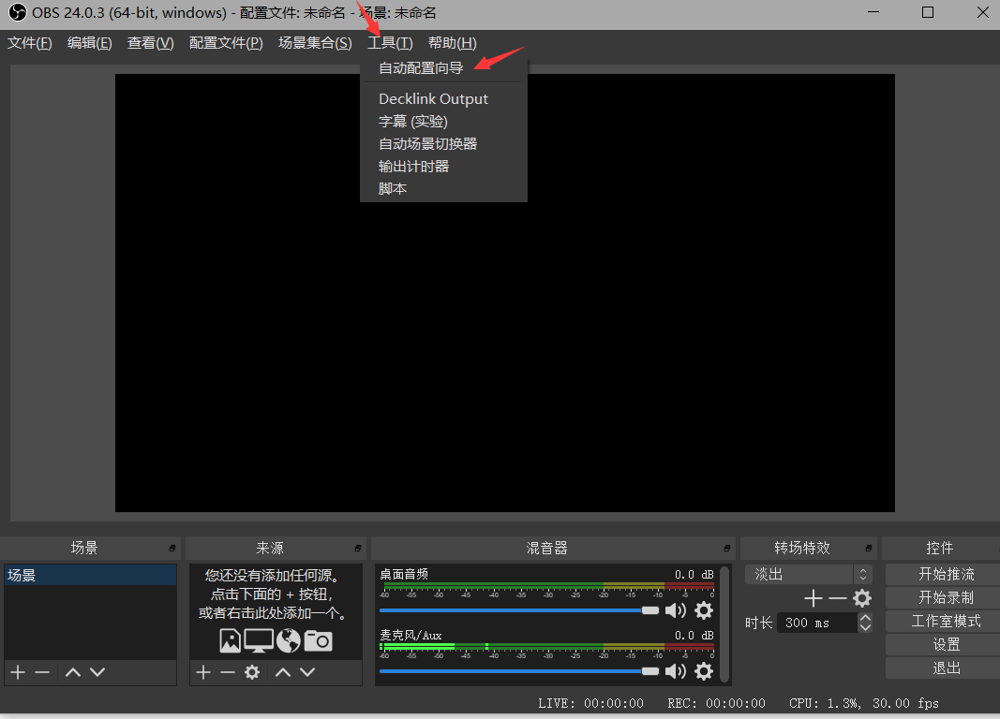


## 4. 基本设置

### 1. 场景

`场景`可以看成是不同的直播界面设置。

> 比如你可能会直播多个游戏 那就可以为每个游戏单独添加一个场景


### 2. 来源

#### 1. 概述

`场景`添加好之后,界面依旧是一片黑 什么都没有，所以接下来需要添加`来源`

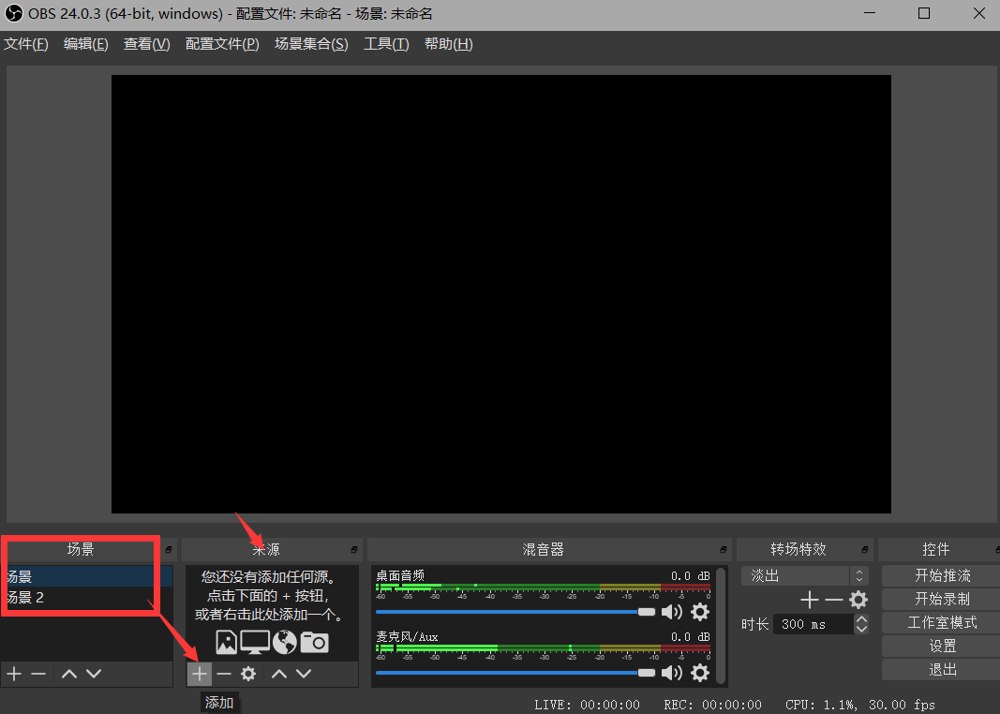

点击`+`号，添加不同的来源。


可以看到当前一共有这么多种来源可以选择。


其中比较常用的包括

* 1.图像
* 2.文本(GDI+)
* 3.显示器获取
* 4.游戏捕获
* 5.窗口捕获

其中需要说明的是:播游戏尽量使用`游戏捕获`，实在不行才使用`窗口捕获`，不推荐使用`显示器获取`

**因为使用游戏捕获的效率远高于其他二者**。

>  这里说一下就是各种来源是可以直接复制的，比如场景1的某些来源场景2可能也需要使用，可以直接在场景1`Ctrl+C`复制，然后切换到场景2`Ctrl+V`粘贴。省去又布置一遍的麻烦。

#### 2. 图像

首先我们要给直播画面添加一张`图片`作为`背景`，**这样在游戏关闭之后直播画面也不黑屏**！

在前面出现的来源中选择`图像` 然后名字可以改成自己想要的，方便自己识别。比如这里我改成`背景图片`

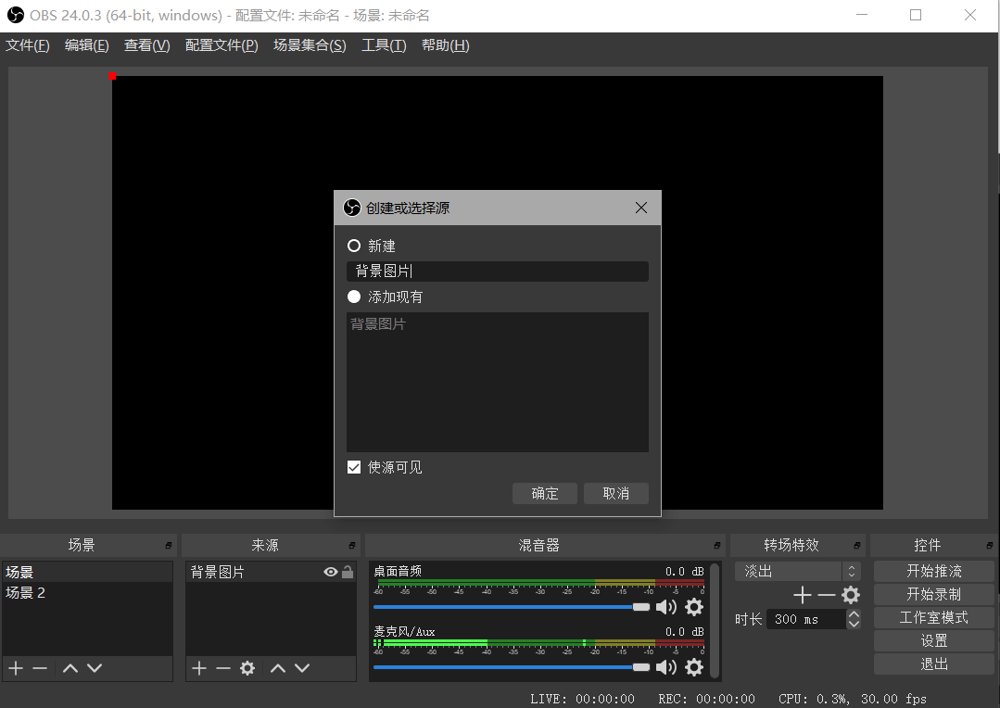


然后点击确定即可添加。

最后点击浏览找到自己想要的图片即可。

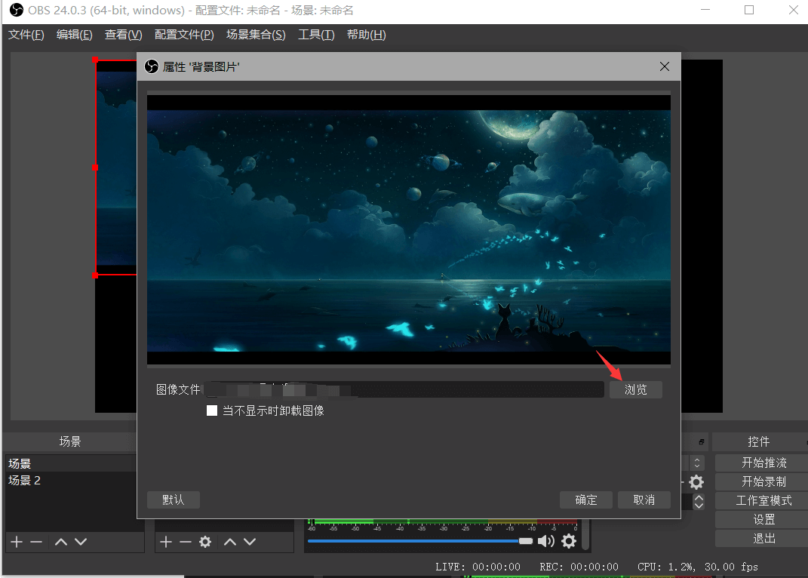

**记得勾选`当不显示时卸载图片`！这样可以节省内存！**

添加图片之后界面大概是这样子的。

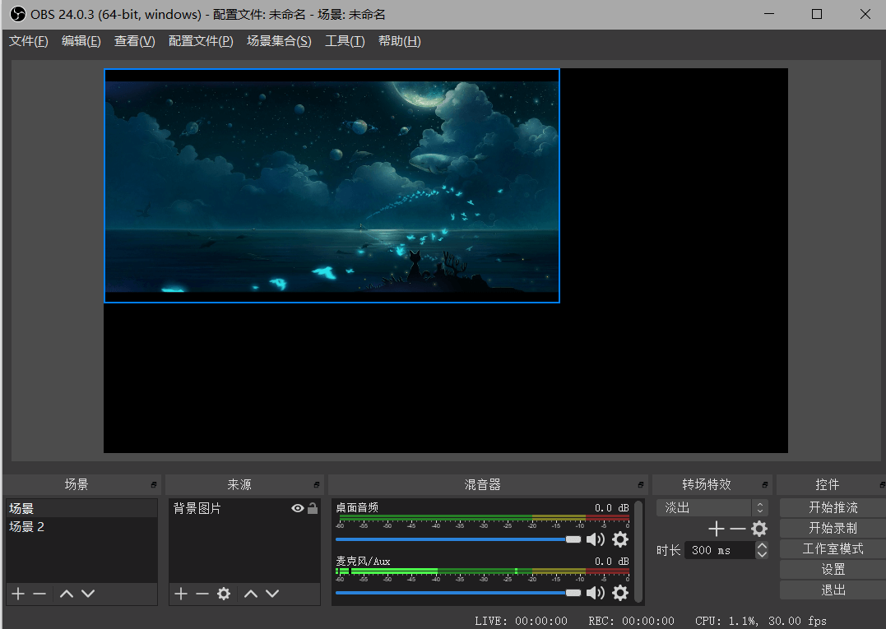

可以看到背景图出现了，但是`大小`好像不对。

接下来我们要做的就是调整图片的大小。


在`背景图片`这个地方`右键`,接着在弹出的`右键菜单`中选择`变换`,可以选择`比例适配屏幕`或者直接`拉伸到全屏`。


这里我选择的是`拉伸到全屏`。大概是这个效果

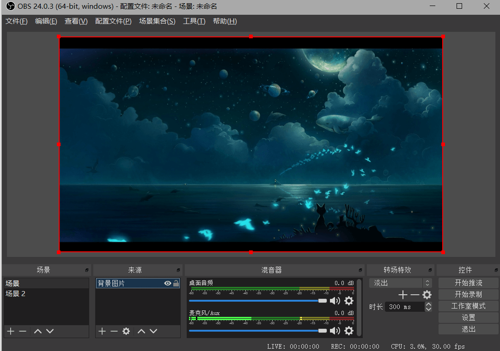


我们的第一个来源`背景图片`就算是添加完成了。然后点击界面右下角的`工作室模式`就可以看到预览。


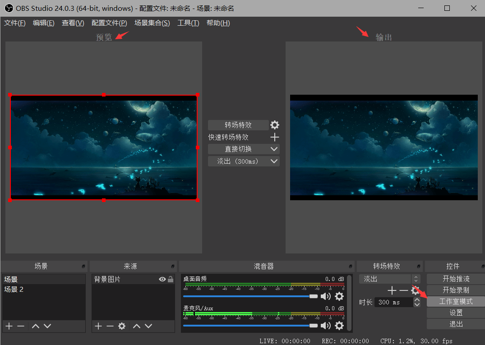


其中`左边`就是我们看到的`预览界面`，`右边`就是直播时观众看到的`真实界面`

当前了 现在我们就只添加了一个背景图片肯定是不能直接开始直播的，还需要添加真正需要直播的内容。比如游戏什么的

#### 3. 游戏捕获

同理 在`来源`界面点击`+`号，添加`游戏捕获`，名字也推荐修改一下，比如改成对应的游戏名。

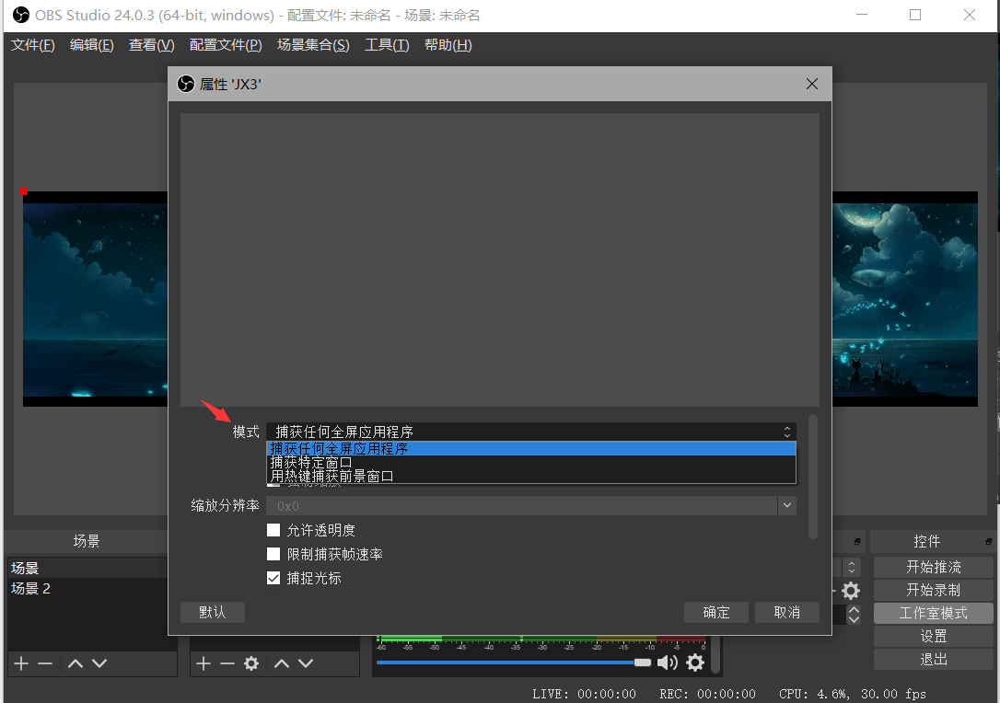


添加之后大概是这样的。

可以看到`模式`这里有3个可以选择

如果是全屏游戏就选`捕获任何全屏应用程序`

窗口游戏则选第二个`捕获特定窗口`

第三个一般不用管，也没用过这个,前两个一般够用了。


大多数游戏都可以使用`捕获特定窗口`来捕获，就算是全屏游戏也可以的。

所以推荐使用这个。

将模式切换到`捕获特定窗口`，同时在窗口列表中找到你要直播的`游戏`。就像这样

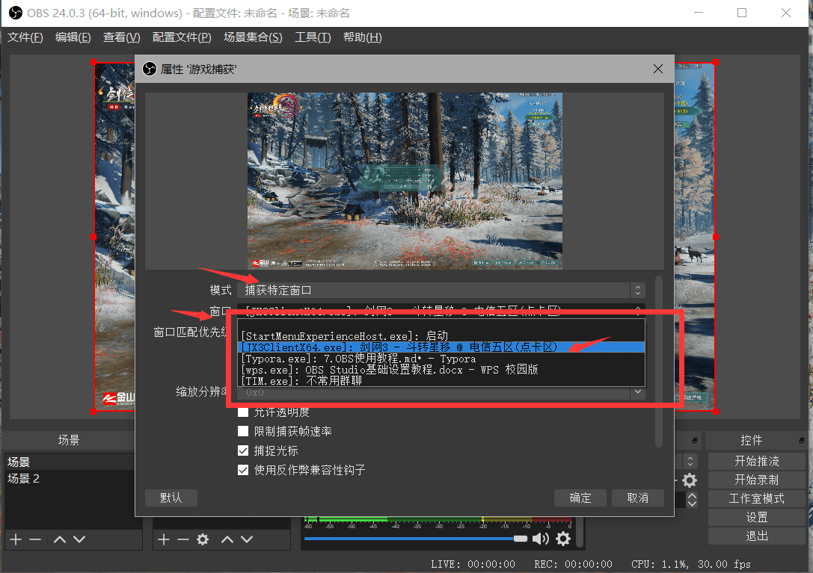


下面的一些具体参数一般使用默认值就行了

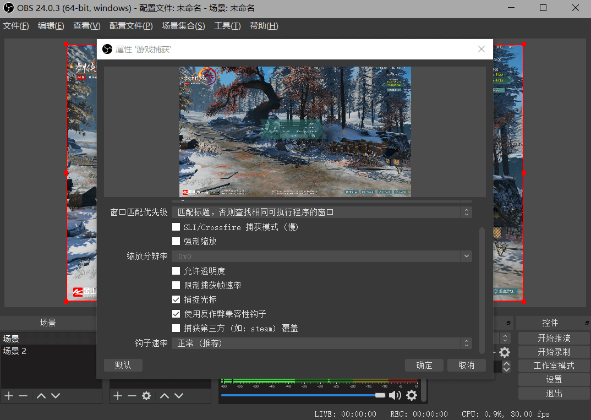


* SLI/CrossFire 捕获模式(慢): 双显卡混合读取模式，相当于显卡交火。 

* 强制缩放: 就是调整分辨率
* 允许透明度：这个勾上之后画面中透明的地方颜色会加深 一般不勾
* 捕捉光标：即显示鼠标
* 使用反作弊兼容性钩子: 一般VAC封禁比较严格的游戏可以勾上,防止你开直播被当成开挂
* 捕获第三方(如:steam)覆盖 ： 直播时捕获第三方的界面信息 比如steam游戏中可以唤起一些steam的功能界面，这个勾上之后直播时画面中也会出现这些信息


游戏源也添加上之后大概是这样的

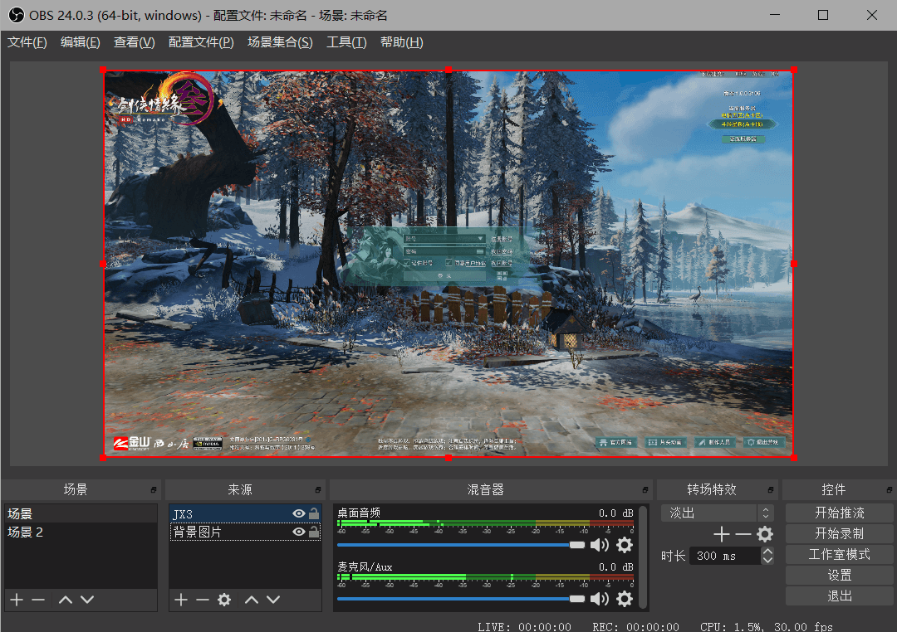


#### 4. 其他

到这里基本上就完成了`来源`添加,如果还需要其他的可以自行摸索添加了。

一般各大主播直播间都有各种信息挂着，我们也可以添加一个`文本`来源。

具体添加步骤和前面一样就不截图了。添加之后效果如下

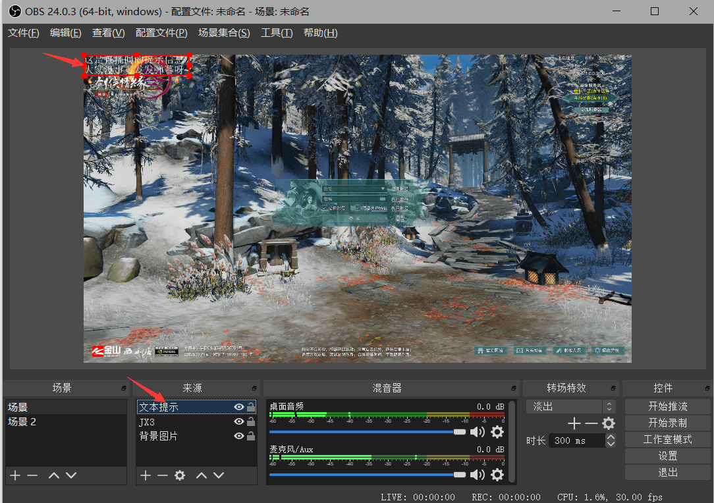

文本的位置也是可以直接在界面中拖动的,字体什么的也可以自己调整。


#### 5. 图层

最后将一下图层的概念。
到这里我们已经添加了3个来源，背景图片、游戏、文本。

但是当前界面中只能看到游戏和问题两个，却看不到背景图。

这里就会有一个图层的概念了。

首先第一点是我们添加的这么多来源是有显示顺序的。排在上面的会优先显示出来。

那么现在的顺序就是文本提示、JX3、背景图片。

由于游戏是全屏的所以背景图片被游戏遮住了，自然就看不到了。

同样的，如果我们把文本提示这个来源放到游戏后面也会被遮挡。

但是游戏问题提示并不是全屏的所以放在游戏之上依旧不会遮挡游戏。

> 添加背景图片的意义就在于当我们关闭游戏时依然有一个全屏的来源可以显示，不至于直播间直接黑屏了。


所以正确顺序就是：

1.背景图片放在最底层

2.游戏界面放在上层

3.其他不是全屏的来源如文本、歌词、小图片等放在最上层


最后点击右边的`眼睛`图标可以隐藏当前来源。

比如现在用不到但是等会可能要用又不想删掉的某些来源。

`小锁`图标表示锁定当前来源，这样锁定之后就不能再改变来源的各种参数了,可以防止误操作修改到已经调整好的来源。

## 5. 开播参数

到这里我们的场景、来源什么的都设置好了。大概是这样子的

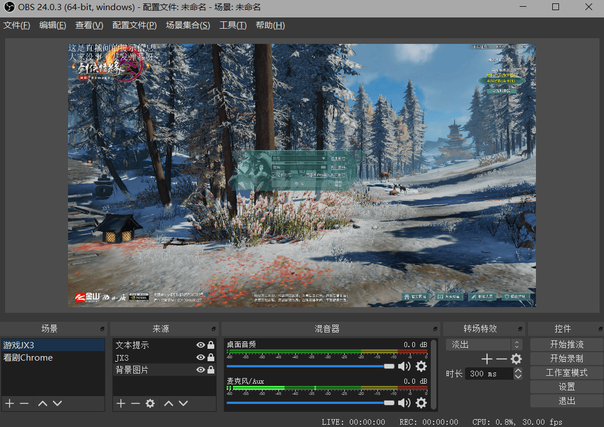

然后调整一下开播参数就可以开始直播了。


找到`文件->设置`进入OBS设置界面


设置界面如下：


可以看到一共有`通用`、`推流`、`输出`、`音频`、`视频`、`热键`、`高级`几栏。

其中通用一般不用管，默认即可

###  1. 推流

这里用来天我们的推流服务器和秘钥什么的,将obs捕捉到的画面推送到服务器。

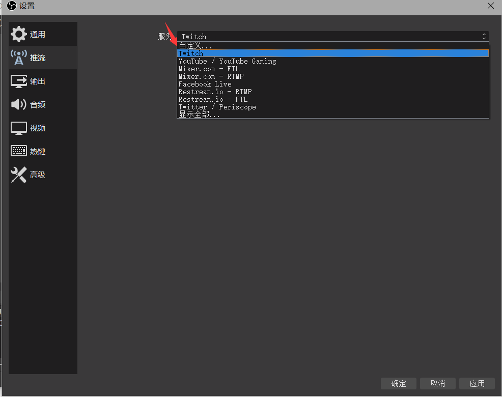


首先把服务器选到`自定义`，因为内置服务器是没有包含国内各大直播平台的。

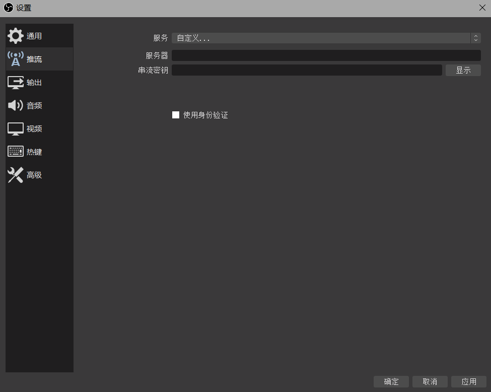
然后这里需要我们填写`服务器`和`串流秘钥`

#### 获取服务器`和`串流秘钥`

各大平台可能有一点差异，但是大体步骤是一样的。

> 由于`串流秘钥`为了安全起见是会经常变化的，所以一般在每次开始直播的时候生成一个新的。

首先进入自己的直播间，然后点击开始直播，一般就会出现`服务器`和`串流秘钥`两个信息。


其中 `你的rtmp地址`就是这里要填的`服务器`

`你的直播码`就是`串流秘钥`了。

### 2.输出

输出选项主要用于设置输出画面的质量，即主要影响观众观看时的清晰度，流畅度等。所以十分重要，需要根据自己的电脑配置和网络情况择优调整。


既然要调整，那么肯定简单模式是不行的。直接将`输出模式`切换到`高级`然后在具体设置。


#### 2.1.串流


##### 音轨

`音轨`这里基本上就用`默认`的1即可

##### 编码器

可以看到编码器有3个选项。

* 1.NVIDIA NVENC H.264(NEW)
* 2.NVIDIA NVENC H.264
* 3.x264

前两个为`显卡编码` 消耗资源较低但是编码出来的画面会丢失一些细节，看起来就会毕竟模糊。

第三个`x264`为`CPU编码`，消耗CPU资源且编码出的画面看着会清晰一些。


**推荐使用`x264`CPU编码**

但是如果直播时发现CPU占用率经常达到`100%`,都不能流畅游戏的话就选择显卡编码。

同样是显卡编码但是第一个是新的大概会比第二个有所提升吧。

##### 强制执行流媒体服务器编码设置

这个就是有个直播服务器可能会有某些特殊设置，如果和你本地的设置冲突之后可能无法正常推送到服务器，一般都会勾上这个。


##### 重新缩放输出

即调整输出视频的分辨率。

如果当前显示器的分辨率为`1080P`那么obs捕捉到的画面也是`1080P`的 最后推送到服务器观众看到的也是`1080P`的画面。

> 当前电脑屏幕分辨率大部分都是1080P所以如果这个缩放输出小于1080P则观众全屏看直播时画面拉伸之后就会毕竟模糊。

但是分辨率越高占用的资源就会越多，如果当前显示器分辨率是1080P以上的可以勾上这个，将输出缩放到`1080P`。

注意:如果当前显示器分辨率只有`720P`然后这里在把缩放调整为`1080P`的话就相当于直接把`720P`拉伸到`1080P`，会极大的降低画质。

##### 速率控制

CPU编码下的几个选项

* CBR: 常数比特率，指文件从头到尾都是一种位速率。相对于VBR和ABR来讲，它压缩出来的文件体积很大。
* ABR: 平均比特率，是VBR的一种插值参数。据说是静态时下降15%码率，动态时增加15%。
* VBR: 动态比特率。也就是没有固定的比特率，当画面静止时会使用较低的码率，画面运动剧烈时会自动调高码率。这样最后保存下来的文件总体积会比较小。
* CRF：在CRF模式下，画质是固定的，present降低，似乎是体积（码率）变大。present升高，体积（码率）变小，压缩率更大。

**推荐使用`VBR`**

##### 比特率

`比特率`又叫`码率`

默认设置的码率是2500

> 网上很多人说什么码率要8000 10000才看得清晰 都是在扯淡。
>
> B站早期码率限制就1800 2000 一样能看清。
>
> 现在虎牙斗鱼新主播码率限制应该是3000左右B站最高能到10000码率

根据自己的网络情况来设置就行了。

测速网址

```sh
http://www.speedtest.cn/
```

上传速度 一般1Mbps=1000码率。

如果上传速度是4Mbps的话理论码率极限是4000 但是一般不要占满了，其他软件也可能需要占用上传带宽。设置个3500就差不多了。

**推荐2500-6000**

> 码率不是越高越好，设置太高了观众看时如果网速不快就是一直缓冲中。。。

##### 最大比特率

由于VBR是动态码率，所以需要单独设置一个最大码率。

一般设置为小于当前网络能够承受的最大码率。

OBS会自动控制在一个合适的范围内，并不是你设置多大就会用到多大。

##### 关键帧间隔

>  首先每个视频都是由一帧一帧构成的。

比如说在录制电脑桌面吧,第一帧鼠标在中间，然后第二帧移动了一下鼠标，那么其他地方是没有变化的 唯一变化的只有鼠标位置，所以一些重复的信息就不用再次记录了，第二帧只需要在第一帧基础上修改一点点即可。

**那么记录了完整信息的帧(这里的第一帧)就叫做关键帧**，由于记录了完整信息所以关键帧会比普通帧大一些，如果一个视频每一帧都设置成关键帧将会极大增加文件大小。


所以如果在玩一些画面变化比较大的游戏，比如射击游戏 需要一直跑动，就可以把关键帧间隔设置小一些(比如1秒)。

画面变化相对比较小的就可以调大一些。

当然了玩射击游戏也有静止的时候，越不会一直在跑。

**所以就设置成0吧 由OBS自动调整。**

##### CRF

画面质量,默认为23.

> 数值越小画面质量越高，同样的占用的`CPU`资源也会越高。

**推荐值为18-26**

18再往下肉眼已经无法看出区别了，所以想要质量好一些的可以设置为18.

如果需要对视频进行二次剪辑什么的可以在设置小一点比如17.这样可以保证再次导出的视频质量依旧很高。

##### 自定义缓存大小

这个参数是表示使用多少缓存来计算压缩后的传输内容，缓存越大，计算出来的品质越好，但是由于在等待缓存填满再计算，会造成延迟（当然一般别写太夸张不会感觉到的），但是和直播延迟无关，只是播放的加载时间，并不是延迟。

**一般情况下，不要动，保持默认。一般用处的使用区别不大。**

如果跑动起来马赛克比较严重，移动时画质不满意，可以逐步提高这个参数，比如默认1500，加大50%左右，到2100。可以有效的改进画质。

##### CPU使用预设


越往上占用CPU资源越少，编码出来的画面也越模糊。

默认是`veryfast`占用中等资源画质也还行。
如果`CPU`资源充足则可以选下面选项的来提升视频质量
如果`CPU`占用过多，游戏产生卡顿则可以降低画面质量来减轻`CPU`压力

##### Profile&协调(类型)

好像是用于处理视频噪点什么的，一般不用管 默认设置即可。

##### x264选项(用空格分隔)

用于一些专业参数什么的。

不用管，空着就行。

#### 2.2 录像

同样的既然要调整就首先把类型切换到`自定义输出`

##### FFmpeg输出类型

默认输出到文件即可。

##### 文件路径

选一个文件夹用于保存录像。

生成没有空格的文件名 这个勾不勾随意。

容器格式默认

Muxer设置 不管

##### 视频比特率

和前面设置成一样的就行了，如果想要视频源文件清晰一点可以调高一些。由于录像是保存在本地的，不需要上传所以设置大一点也没问题，只是会让生成的视频文件更大。

##### 关键帧间隔

这个地方关键帧间隔和前面是同一个东西，但是单位不同。

前面是秒，这里是帧。
假设前面关键帧间隔设置的是1秒一个关键帧，然后视频是60FPS的，那么就是每60帧一个关键帧。这里就设置为60。

##### 音频比特率

默认为160。可以调高一些。

> b站好像是已经支持320了。

其他选项就保持默认值就行。


#### 2.3 音频

全部把比特率从默认的160调整为320就好了。

#### 2.4 回放缓存

勾上之后可以让你实时看到前10-20秒的画面。

不过勾选不了，不知道为什么。

### 3. 音频

通用

* 采样率:默认44.1khz

* 声道：默认立体声

设备

这里就根据自己的情况选择就行了。音频麦克风什么的。

其他选项默认即可。

### 4. 视频

* 基础分辨率：即视频录制的分辨率
* 输出分辨率：真正输出的分辨率
* 缩放过滤器:默认为双立方(锐化缩放,16个样本) 如果真的需要缩放的话建议选择`Lanczos(锐化缩放,32个样本) ` 让视频缩放和不至于太模糊。
* FPS值：即画面的FPS值，如果游戏运动毕竟快就选60FPS,其他的就选30PFS。

### 5. 热键

在这里可以设置各种快捷键，有需要的慢慢研究即可。

### 6. 高级

通用

* 进程优先级:就是当电脑资源不够用时优先把资源给什么软件使用。默认常规即可。

视频

* 所有选项默认即可。

录像

* 自动封装至MP4格式: 勾选后会在停止录制时把视频转为MP4格式。(默认录制格式为mkv)

流延迟

* 就是直播延迟时间 一般玩某些实时游戏为了防止对面窥屏 可以设置一定的延迟。

自动重连

* 默认即可

网络

* 默认即可

其他也保持默认即可。

### 7.麦克风

如果麦克风不好的话可能会有杂音，可以通过添加滤镜来过滤掉这部分杂音。


然后添加一个`噪声抑制`的滤镜


抑制程度调到`-21db`就差不多了


同时还可以设置麦克风监听，让自己听到自己说的话。


点击麦克风右边的`齿轮->高级音频设置`

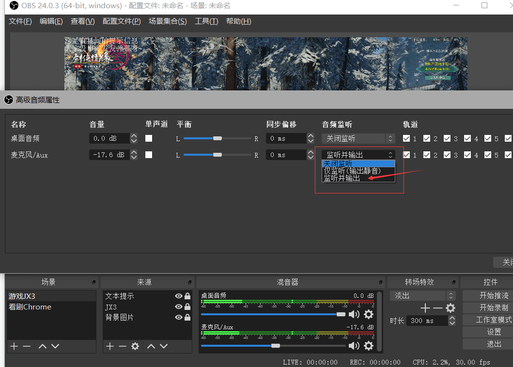

然后麦克风音频监听一栏选择监听并输出。

差不多要设置的都讲了，其他插件相关的后续补充。